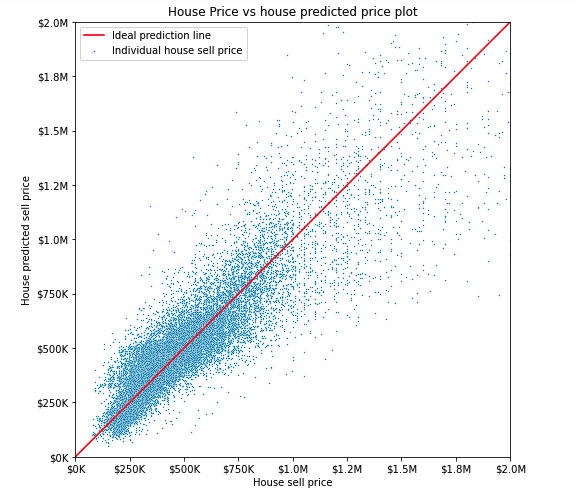
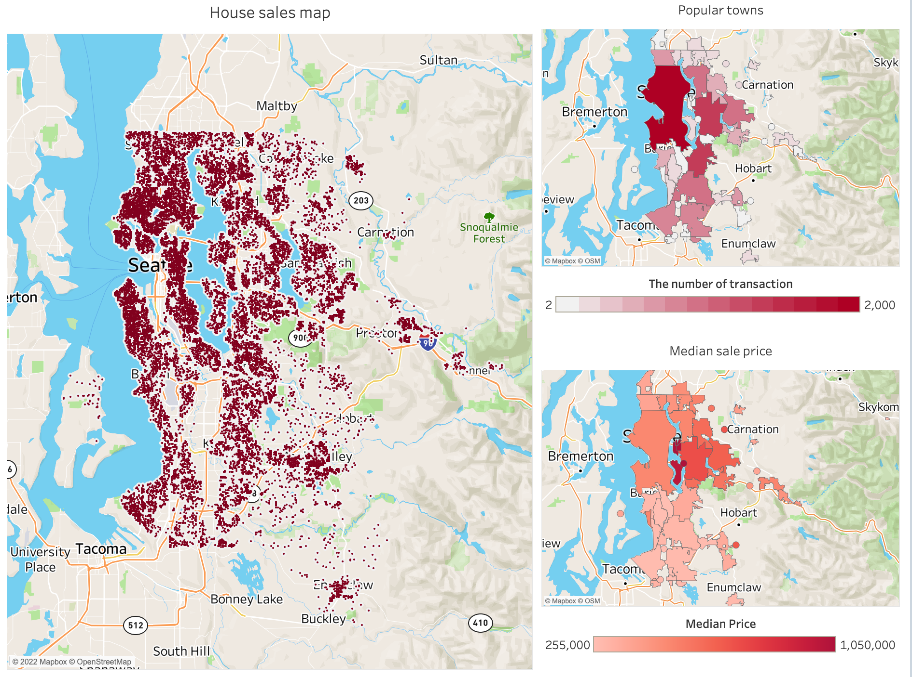

# King County, WA Housing Sales Analysis


# Overview
Our team was hired by a major Seattle real estate agency to create a model which can predict the price of a house in the King County area based on differnt features. Our analysis concluded that the best features for prediction of housing prices are the following: city/town/neighborhood location, square footage, number of bedrooms, whether it's on the water, how good of a view it has, the property condition, and the age of the property.

To acheive our goal, we used multiple linear regression models to analyse housing sales in King County, WA using housing data gathered within the county from 2014 and 2015. For this analysis, we used Ordinary Least Squared, Train-Test Split, and K-Fold Cross Validation regression models to create an efficient predictive model.


# Business Understanding
Our stakeholder wants to be able to predict the price of a house based on certain features provided by their customers. 

Our project will answer the following questions:
* With what accuracy could we predict the prices of houses based on these features?
* What specific housing features will provide us with the most accurate model? 


# Data Understanding
The data used for this project was sourced from a dataset called ‘King County House Sales’ and contains information regarding housing sales statistics in King County, WA.

##### The dataset contains the following columns:

* ```id```: A unique sale id relating to a house sale
* ```date```: Date of house sale
* ```price```: The price which the house sold for
* ```bedrooms```: How many bedrooms the house has
* ```bathrooms```: How many bathrooms the house has
* ```sqft_living```: How much square footage the house has
* ```sqft_lot```: How much square footage the lot has
* ```floors```: How many floors the house has
* ```waterfront```: Whether the house is on the waterfront. Originally contained ‘YES’ or ‘NO’, converted to 0 or 1 for comparative purposes
* ```view```: Whether the house has a view and whether it’s fair, average, good, or excellent. Converted to numberical (0-4) for comparative purposes
* ```condition```: overall condition of the house: Poor, Fair, Average, Good, Very Good
* ```grade```: Numerical grading for house
* ```sqft_above```: How much of the houses square footage is above ground
* ```sqft_basement```: How much of the square footage is in the basement
* ```yr_built```: Year the house was built
* ```yr_renovated```: Year the house was renovated, if applicable
* ```zipcode```: House zipcode
* ```lat```: House’s latitude coordinate
* ```long```: House’s longitude coordinate
* ```sqft_living15```: Average size of living space for the closest 15 houses
* ```sqft_lot15```: Average size of lot for the closest 15 houses

In addition to the King County Housing Sales dataset, we used data from the following sources:

Open Street Maps 
The largest website related to geographical maps and geolocation coding of locations
website: www.openstreetmap.org) 

Washington Geospatial Open Data
Official website of Washington state, US. The website contains different geospatial information about cities and their boundaries. 
Website: https://geo.wa.gov/


# Modeling
This project uses linear regression models, such as Ordinary Least Squared, Train-Test Split, and K-Fold Cross Validation to provide predictive modeling for our real estate stakeholder

We began by splitting our data frame into three sections by feature type:

1) House features such as square footage and room numbers
2) House quality and age
3) House location within King County (City/Town/Suburb). This process was done through geoparsing the latitude and longitude columns

We then created linear regression models for each section, iterating through different feature combinations, and narrowed down our features by assessing coorrelation, eliminating potential multicollinearity issues, and determining the most statistically significant combination.

Finally, we combined the updated selection of column features and created a final regression model and corresponding visualization for our overall prediction. Our final model gave us our highest R2 score with the lowest RMSE.


# Regression Results
Our regression model results are as follows:

* House feature regression model concluded that bedrooms, living square footage, waterfront, and view quality columns were statistically significant with price and independent of each other

* House quality regression model concluded that property grade and age are statistically significant with housing prices and independent of each other

* Instead of using the zipcode column, we opted for geoparsing the latitude and longitude columns in hopes that the data in the form of city/town/neighborhood would provide a better model. We concluded that using neighborhood was significantly more effective than zipcode and improved our R2 score by about %15.

Our 'House Predicted Price' scatter plot shows how well our finalized predicted regression model fits the individual selling prices of houses



Below is an image showing the results of our geoparsing method which converted latitude and longitude coordinates into city/town/neighborhood data to increase regression model performance




# Conclusion
Our finalized linear regression calculator shows that our model is able to account for %80.1 of the variance in price. This final regression maximizes R^2 score and minimizes root mean squared error based on our features.

Overall, this data tells us that with our selected feature columns (age, grade code, bedrooms, living square footage, waterfront, and view quality) combined with locational data, 80.1% of the variance in price can be explained by our model, which allows us to conclude that this model is a good fit for our data.

We have used this regression calculator to predict the average housing prices for each neighborhood to show us where the predicted most-to-least expensive houses are located


# Further Questions
See the full analysis in the [Jupyter Notebook](https://github.com/hannah-schurman/dsc-phase2-project/blob/main/housing_sales_modeling.ipynb) or review [this presentation](https://github.com/hannah-schurman/dsc-phase2-project/blob/main/housing_sales_presentation.pdf)


# Repository Structure
```
├── data                                       #shows pickle files for geolocation as well as king county dataset
├── images                                     #contains visualizations produced by our models
├── README.md  
├── housing_sales_modeling.ipynb               #regression models
├── Geo_parsing.ipynb                          #methodology used for geolocating coordinates
└── Housing_Sales_Modeling_Presentation.pdf    #non-technical stakeholder presentation on regression findings
```


